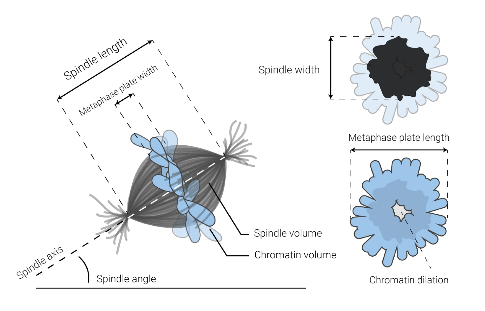
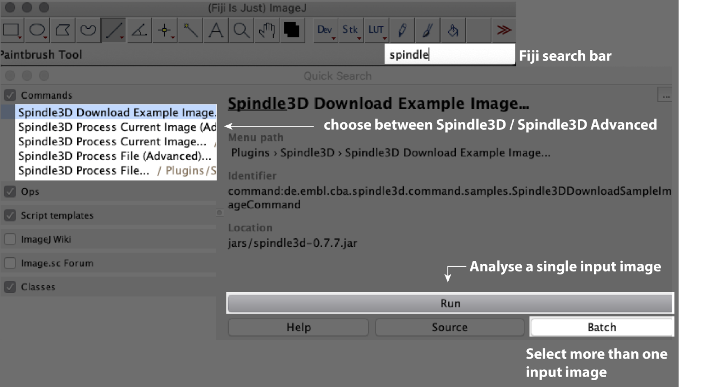
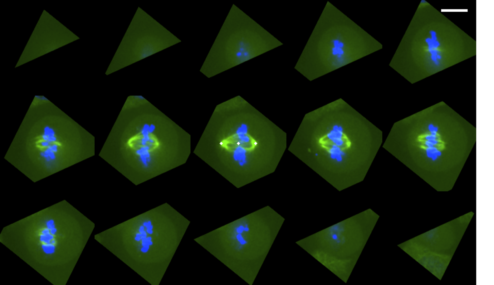
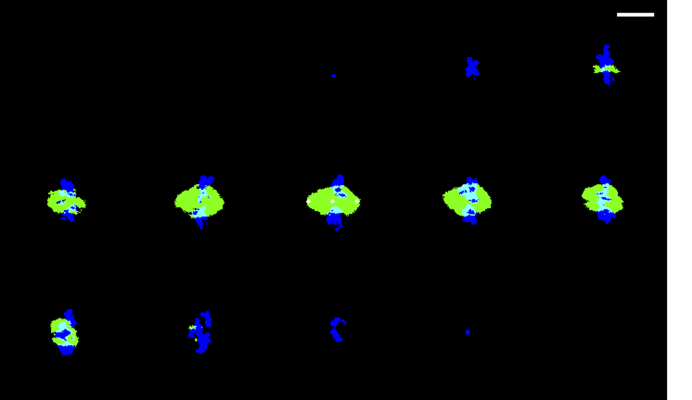
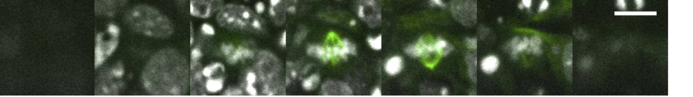

A Fiji plugin for the automated measurement of 3D morphological parameters of volumetric images of mitotic spindles.

## Input Data Requirements

You can download a set of example images via:
Plugins > Spindle3D > Spindle3D Download Example Image

Spindle3D quantifies spindle and chromatin morphology in 2-colour confocal image stacks. It requires fluorescent labellings of microtubules (e.g. tubulin-GFP, anti-tubulin immunostainings, etc.) in one channel, and chromatin (e.g. histone-GFP, DAPI, etc.) in the other.  

Please make sure to save a crop of your spindle of interest before the analysis. This will save computing time and prevent erroneous analysis. For cropping in Fiji, we recommend using the rectangular selection tool for drawing a region of interest around your spindle. Next copy your selection [Image > Duplicate > Duplicate stack] and save that copy.

Please make sure that your input image is calibrated, i.e. the xy-length of your voxels and the z-step size are annotated in your image metadata. In Fiji, you can verify this in [Image > Properties].  

No other preprocessing is required. 

Optional: Cell volume mask
Spindle3D will look for an additional file called [Name of input image] + ”_CellMask.tif” in the same folder as the input image. The binary image should contain the mask of the cell in question and should have the same dimensions and calibration as the input image. If provided, only the voxels within the cell mask will be used for the analysis.

Spindles tested so far: HeLa Kyoto, HEK293, mouse embryonic stem cells, Ptk2, Bovine 1-cell and 2-cell embryos

We recommend verifying your analysis using the Spindle3D output images (see section "Output images").

## Publication

To cite this plugin and for a detailed documentation of the image analysis procedures, please use the following [bioRxiv preprint](https://biorxiv.org/cgi/content/short/2021.04.08.438956v1).

## Install

- Install [Fiji](https://fiji.sc/)
- Start Fiji and [add the following update sites](https://imagej.net/How_to_follow_a_3rd_party_update_site):
  - [X] Spindle3D
  - [X] 3D ImageJ Suite
- Restart Fiji

## Measurements

Each analysis will generate an output table with the following morphometric measurements. 

#### Cell Volume (µm3)
Volume of the cell mask, if provided (see “Requirements for input image”).

#### Chromatin Dilation
Measure of a central opening within the metaphase plate.

#### Chromatin Volume (µm3)
Volume of the segmented chromatin signal.

#### DNA Threshold
Threshold value that was applied for the volumetric segmentation of the chromatin.

#### Metaphase Plate Length (µm)
Average diameter of the metaphase plate.

#### Metaphase Plate Width (µm)
Average thickness of the metaphase plate along the direction of the spindle axis.

#### Spindle Angle (Degrees)
Tilt angle between the spindle axis and the xy plane of the original coordinate system.

#### Spindle-Aspect Ratio
Ratio between spindle length and width.

#### Spindle-Center-To-Metaphase-Plate-Center Distance (µm)
The distance between the center of the segmented chromatin and the center of the segmented spindle.

#### Spindle Intensity Variation
Coefficient of variation of the gray values within the spindle mask. 

#### Spindle Length (µm)
Spindle pole-to-pole distance.

#### Spindle SNR
The signal-to-noise ratio between the average spindle tubulin signal and the outside tubulin signal

#### Spindle Volume (µm3)
Volume of the segmented tubulin signal. 

#### Spindle Width Avg (µm)
Average width of the segmented spindle (perpendicular to the spindle axis).

#### Spindle Width Max (µm)
Maximum width of the segmented spindle.

#### Spindle Width Min (µm)
Minimum width of the segmented spindle. 

#### Tubulin Cellular Average Intensity
Mean voxel gray value within the cell mask, if a cell mask was provided (see “Requirements for input image”). Note: This is the raw, non-background corrected value!

#### Tubulin Spindle Average Intensity
Mean voxel gray value within the spindle mask. Note: This is the raw, non-background corrected value!

#### Tubulin Spindle Intensity Threshold
Threshold applied for the volumetric segmentation of the spindle. 

## Quick start

- Plugins > Spindle3D > Spindle3D Download Example Image
- Plugins > Spindle3D > Spindle3D Process Current Image
  - DNA channel index: 1
  - Tubulin channel index: 2 

## Run

You can open your input image and start the analysis via:
- Plugins > Spindle3D > Spindle3D Process Current Image
- Plugins > Spindle3D > Spindle3D Process Current Image (Advanced)

Alternatively, you can specify the location of your input image and start the analysis via:
- Plugins > Spindle3D > Spindle3D Process File
- Plugins > Spindle3D > Spindle3D Process File (Advanced)

## Spindle3D

This is the basic execution of the morphometric analysis.

- Input Image File: Specify the location of your input image on your computer. This option will be missing when you specified multiple images in the batch processing mode. 
- Output Directory: Specify the output folder.
- DNA Channel Index: Specify, which channel number in your input image corresponds to the DNA or chromatin signal. 
- Spindle Channel Index: Specify, which channel number in your input image corresponds to the spindle signal. 

## Spindle3D Advanced

In the advanced version of the plugin, you can adjust key parameters to your needs. The overall analysis workflow will be the same as in the basic plugin. 

- Voxel size for analysis: Here you can specify the isotropic voxel size (in µm) for the analysis. Before the analysis, Spindle3D will resample the input image such that all voxels will have the specified length in x,y and z, regardless of their native voxel dimensions. Please be advised that smaller voxel sizes (“higher resolution”) will lead to longer computation times. We recommend the default 0.25 µm for optimal resolution and processing speed. 
- Minimum dynamic range: Sets the minimum gray value the DNA signal should at least have above the background. If this range is not met, the analysis will abort. 
- Axial spindle poles refinement search radius: Specifies the maximum distance (in µm) from the intersection of spindle mask and spindle axis that the spindle poles will be looked for in the direction of the initial spindle axis. (See Methods) 
- Lateral spindle poles refinement search radius: Specifies the maximum distance (in µm) from the intersection of spindle mask and spindle axis that the spindle poles will be looked for in the direction that is orthogonal to the initial spindle axis. (See Methods)
- Smooth spindle: If this box is checked, the binary spindle volume mask will be smoothed with a morphological filtering (opening) operation. 
- Show intermediate images: This will open various intermediate output images at crucial steps of the analysis. Not recommended when processing images in batch mode. 
- Show intermediate plots: This will open various profile plots that are generated during the analysis. Not recommended when processing images in batch mode.

## Output images

#### Input data oriented along the spindle axis

Z montage of Spindle3D output images. HeLa Kyoto spindle, tubulin-GFP (green), SiR-DNA (blue), spindle center and poles (white). Scale bar: 10 µm. 

#### Binary spindle and metaphase plate masks

Z montage of Spindle3D binary masks output (2). HeLa Kyoto spindle, spindle mask (green), chromatin mask (blue), spindle center and poles (white). Scale bar: 10 µm. 

## Troubleshooting

#### Spindle poles and/or spindle axis wrong
If the automated analysis fails to correctly locate the spindle poles and/or direction of the spindle axis, this can have multiple causes. Spindle3D expects the chromatin plate to be round and disc-shaped, and the direction of the shortest chromatin axis initially sets the direction of the spindle axis. Thus, if the chromatin shape in your input image is e.g. squashed, Spindle3D will run into problems. 

If the error is not grave, you can however adjust the analysis to locate the spindle poles better. To do so, in the Spindle3D advanced mode, experiment with your pole refinement search radii. This will decrease or increase the space in which Spindle3D looks for the poles.  

#### Analysis segments the wrong object, or fails entirely

If there are too many bright objects in close proximity to your spindle and mitotic chromatin, the analysis might run into errors and abort, or it fails to properly separate the objects. 

In crowded environments such as these, automated analysis via Spindle3D might fail. (Tubulin (green), Hoechst (gray), scale bar: 10 µm.) 

To overcome this challenge, we recommend providing a binary cell mask along with your spindle input image. You can create these manually (e.g. using the volume manager in the SCF MPI-CBG Fiji package) or e.g. using the segmentation tool Ilastik (Berg et al., 2019). Next, simply drop the file containing the cell mask ([Name of input image] + ”_CellMask.tif”) in the same folder as your input image and Spindle3D will exclude all pixels that are not within the cell mask from the analysis. 

Another reason for failing analyses might be, that your spindle and/or chromatin are touching any of the image borders. Please make sure to image and crop your spindles in a way that their three-dimensional extents are fully covered. 
